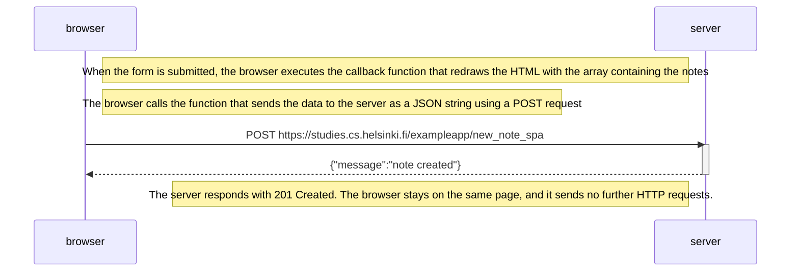

# 0.4: New note in SPA diagram

```mermaid
sequenceDiagram
participant browser
participant server

    Note right of browser: When the form is submitted, the browser executes the callback function that redraws the HTML with the array containing the notes
    Note right of browser: The browser calls the function that sends the data to the server as a JSON string using a POST request

    browser->>server: POST https://studies.cs.helsinki.fi/exampleapp/new_note_spa
    activate server
    server-->>browser: {"message":"note created"}
    deactivate server

    Note left of server: The server responds with 201 Created. The browser stays on the same page, and it sends no further HTTP requests.
```
